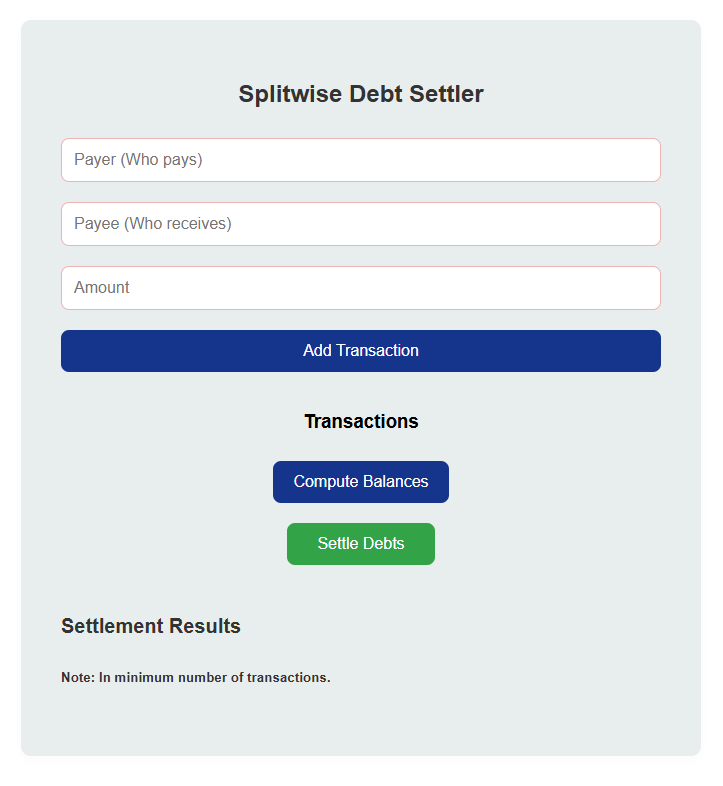
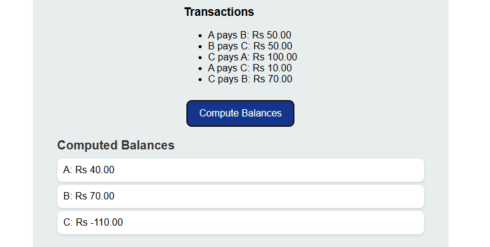
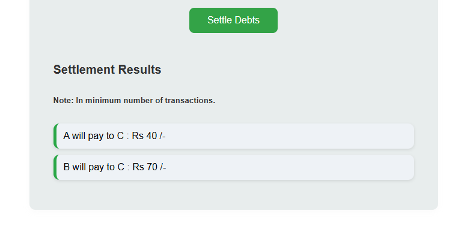

# Debt Settler Web App 🏦💸

Welcome to **Debt Settler**, the ultimate solution to manage and settle debts with ease! Whether you're splitting expenses with friends, managing group expenses, or settling debts within a family or team, this React-based web application makes it efficient and hassle-free. 😎

## **Overview** 🔍
The **Debt Settler Web App** helps users manage their debts in an optimal way by reducing the number of transactions required to settle them. Using advanced **Graph** and **Heap** algorithms, the app calculates how debts can be minimized between multiple participants, ensuring a smooth and straightforward settlement process. 💡

### **Features** ✨
- **Add Participants and Debts** 🧑‍🤝‍🧑💰: Easily add participants and specify their debts. Whether it's money owed or money to be received, enter it all with just a few clicks.
- **Optimal Debt Settlement** 🔄: The app calculates the most efficient way to settle all debts, ensuring that participants settle with the fewest possible transactions.
- **Visual Representation** 📊: View the debt settlements visually, so you can see exactly how each participant is affected by the settlements.
- **Debt Minimization** 🚀: Using advanced algorithms, the app minimizes the number of transactions required to settle all debts, making it fast and efficient.
- **Real-Time Calculation** ⏱️: As you add debts or change amounts, the app recalculates the optimal settlements on the fly.

### **Tech Stack** 🛠️
- **Frontend:** Built with **React** (⚛️), **HTML** (📄), **CSS** (🎨), and **JavaScript** (💻) to provide a sleek and interactive user experience.
- **Algorithms:** Implements **Graph** (🔗) and **Heap** (🏋️) algorithms to optimize debt settlements and minimize transactions.
- **Backend (Optional):** Built with **Node.js** (🌐) and **Express** (🚀) (if backend integration is required).
- **Database (Optional):** For future integration with databases like **MongoDB** (💾) or **Firebase** (🔥) for persistent data storage.

## **Screenshot** 📸
Here’s a screenshot of the **Debt Settler Web App** in action:

Landing Page



Computing Balances



Settling Debt



--------------------------------------------------------------------------------------------

## **How to Get Started** 🚀

Follow these simple steps to set up the **Debt Settler Web App** on your local machine:

### **Step 1: Clone the Repository** 
Clone this repository to your local machine:
```bash
git clone https://github.com/yourusername/DebtSettlerWebApp.git
```

### **Step 2: Install Dependencies** 📦
Navigate to the project directory and install the required dependencies:
```bash
cd DebtSettlerWebApp
npm install
```

### **Step 3: Start the Development Server** 🖥️
Run the development server:
```bash
npm run dev
```
Your app should now be running at [http://localhost:3000](http://localhost:3000).

### **Step 4: Start Settling Debts** 💵
- Open the app in your browser and start adding participants.
- Enter debts and let the app calculate the optimal debt settlement for you.

---

## **How it Works** 🧠

The app works by representing debts as a **Graph**, where each participant is a node and debts between them are edges with weights. Using **Heap** algorithms, the app minimizes the number of transactions by efficiently selecting the participants that can settle their debts most effectively. 📈

----------------------------------------------------------------------------------------

## **Contributing** 🤝

Feel free to fork the repository and make contributions! Here are a few ways you can help improve the app:
- Fix bugs or improve the UI/UX. 🛠️
- Add more advanced debt settlement algorithms. 📊
- Implement user authentication for saving debt records. 🔒
- Contribute to documentation and tutorials. 📚

----------------------------------------------------------------------------------------

